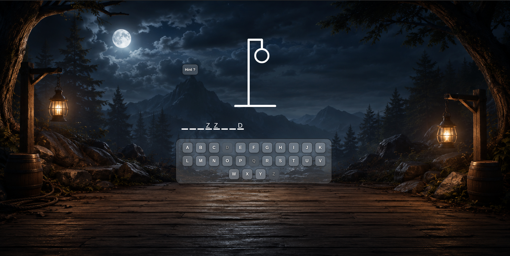
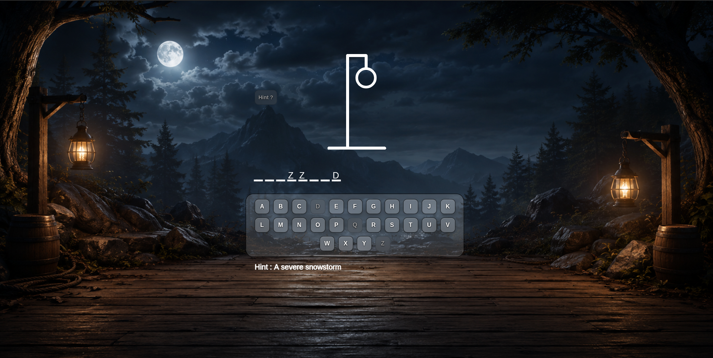
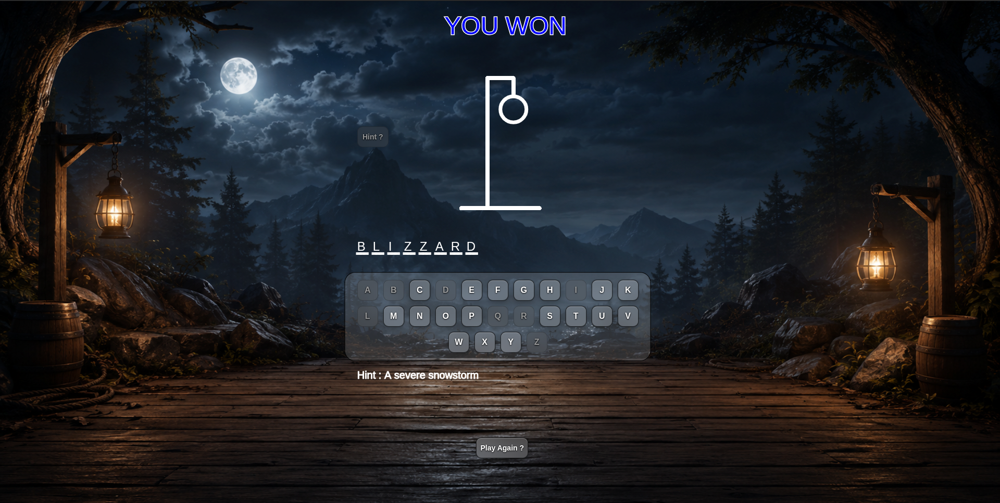
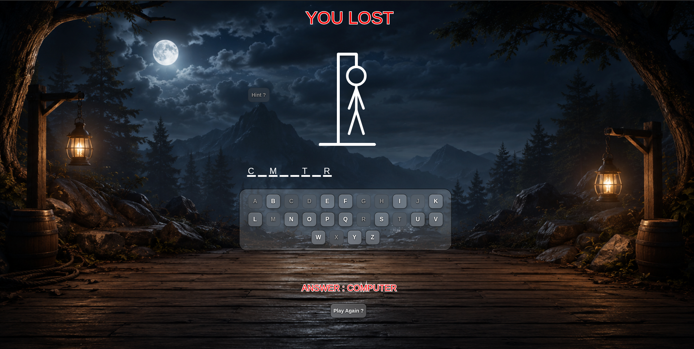

# Hangman

Hangman is a browser-based word guessing game where players attempt to uncover a hidden word by selecting letters from an on-screen keyboard. Each incorrect guess adds a new part to the hanging figure, bringing the player closer to defeat. The challenge lies in identifying the word before the hangman drawing is completed.

Built with **JavaScript** and **p5.js**, this project explores game logic, event-driven programming, dynamic UI generation, JSON data handling, audio integration, and responsive web development. The game features a custom dark fantasy-themed interface, hint system, animated game states, sound effects, and randomly selected words loaded from external data.

---

## Preview

### Gameplay



### Hint System



### Victory Screen



### Defeat Screen



---

## Features

* Classic Hangman gameplay
* Random word selection from JSON data
* Interactive on-screen keyboard
* Hint system for difficult words
* Dynamic word rendering
* Progressive hangman drawing
* Sound effects for user interactions
* Custom You Win screen
* Custom You Lost screen
* Glassmorphism-inspired UI
* Dark fantasy themed background
* Responsive full-screen gameplay
* Play Again functionality

---

## Technologies Used

* JavaScript
* p5.js
* HTML5
* CSS3
* JSON

---

## Getting Started

### Clone the Repository

```bash
git clone https://github.com/dslord/Hangman.git
cd Hangman
```

### Run the Project

Open `index.html` in your preferred web browser.

---

## Gameplay

1. Launch the game.
2. A random hidden word is selected.
3. Click letter buttons to guess characters.
4. Correct guesses reveal matching letters.
5. Incorrect guesses add parts to the hangman.
6. Use the hint button if needed.
7. Guess the complete word before six mistakes.
8. Win by revealing all letters.
9. Lose if the hangman drawing is completed.

---

## Project Structure

```text
├── assets/
│   ├── Preview1.png
│   ├── Preview2.png
│   ├── Preview3.png
│   └── Preview4.png
│
├── Game/
│   └── sketch.js
│
├── sound/
│   └── clickbutton.mp3
│
├── sprites/
│   └── bg.png
│
├── src/
│   ├── p5.js
│   ├── p5.min.js
│   ├── p5.play.js
│   └── p5.sound.min.js
│
├── index.html
├── style.css
├── words.json
└── README.md
```

---

## Game Rules

| Rule | Description |
|--------|-------------|
| Correct Guess | Reveals matching letters in the word |
| Incorrect Guess | Adds one part to the hangman |
| Hint Usage | Reveals a clue related to the word |
| Win Condition | Guess the complete word |
| Lose Condition | Reach six incorrect guesses |

---

## Game Components

### Word System

* Words are loaded dynamically from `words.json`
* Each word includes a corresponding hint
* A random word is selected every game

### Keyboard System

* Interactive A–Z letter buttons
* Disabled after selection
* Visual feedback through custom styling

### Hint System

* One-click hint reveal
* Displays a clue related to the current word
* Prevents repeated usage

### Hangman Drawing

The hangman is drawn progressively for each incorrect guess:

1. Head
2. Body
3. Left Arm
4. Right Arm
5. Left Leg
6. Right Leg

---

## Audio

The game includes sound effects for:

* Button interactions
* Letter selection
* General user feedback

---

## Contributing

Contributions are welcome. Feel free to fork the repository, create a feature branch, and submit a pull request.

---

## License

This project is licensed under the MIT License.

---

Developed by **dslord**.